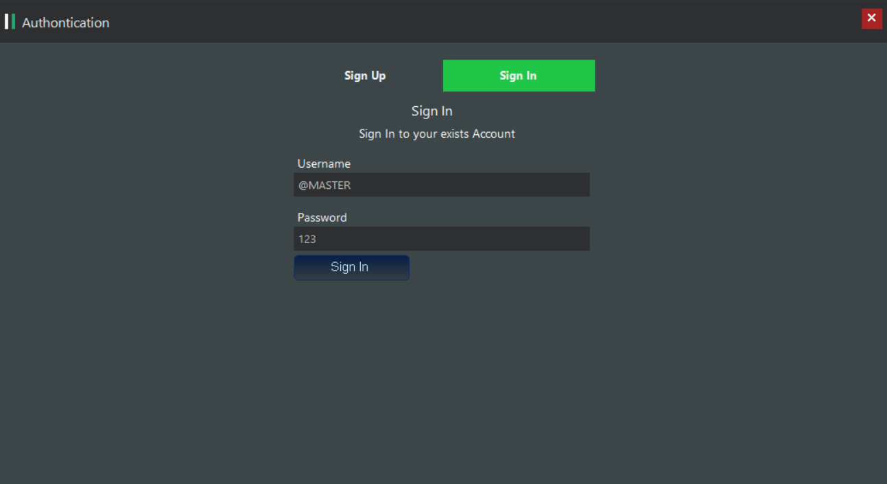

# market_dektop
 ## This app has 4 permiision, 1- for super admin, 2- admin, 3- Firm, 4- Customer
 ## super admin can CRUD admins, firms & categories, admin can CRUD firms & categories, firms can CRUD its products using categories admin added, customer can see all products added by firms and select what he want and buy and search 
 # Make sure to go to Database folder will find sql server script that generate main tables and data..
 ### super admin username => @MASTER , password: 123
 ### All Admin & firms & accounts info encrypted by 64bit algorithm for secure the privacy if database hacked

#### تسجيل حساب جديد في النظام

#### تسجيل الدخول

#### عمل crud للأدمن من قبل السوبر أدمن

#### عمل CRUD للشركات من قبل الأدمنس

#### عمل CRUD للشركات من قبل الأدمن

#### عمل CRUD للمنتجات من قبل الشركة

#### عرض المنتجات للزبون

